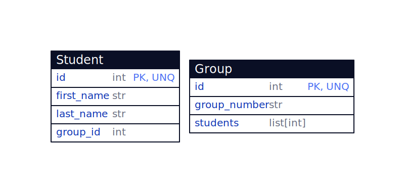

# Сервис для хранения информации о студентах

## Краткая информация

Сервис представляет из себя fastapi проект, предоставляющий api для сохранения и получении информации о студентах и группах студентов. Проект предоставляет следующие api эндпоинты:
- Создать студента
- Создать группу
- Получить информацию о студенте по его id
- Получить информацию о группе по ее id
- Удалить студента
- Удалить группу
- Получить список студентов
- Получить список групп
- Добавить студента в группу
- Удалить студента из группы
- Получить всех студентов в группе
- Перевести студента из группы A в группу B

Хранение информации осуществляется в локальной базе данных `sqlite`.

## Хранение данных

На рисунке ниже представлен вид моделей студента и группы:



## Зависимости

Контроль за зависимостями осуществляется с помощью `Poetry`. Список требуемых зависимостей описан в файле `pyproject.toml`.

Для установки зависимостей необходимо установить `poetry` и выполнить `poetry install`:

```sh
pip install poetry
poetry install
```

## Запуск

После установки всех зависимостей проект запускается с помощью:

```
python3 main.py
```